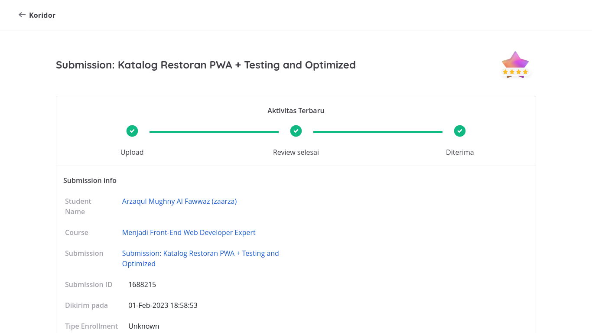
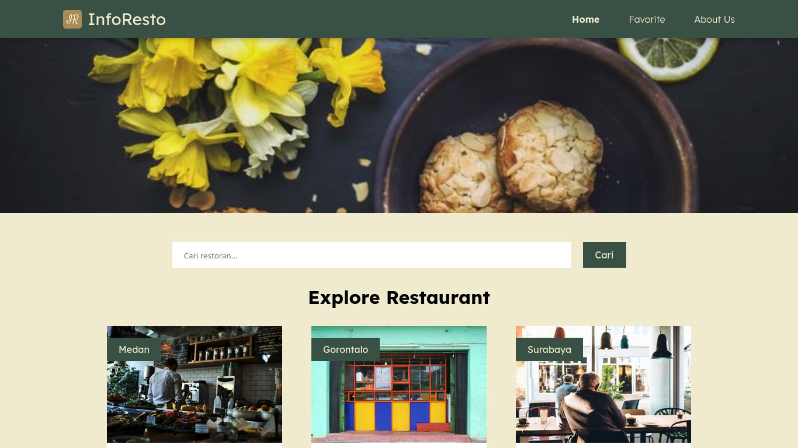
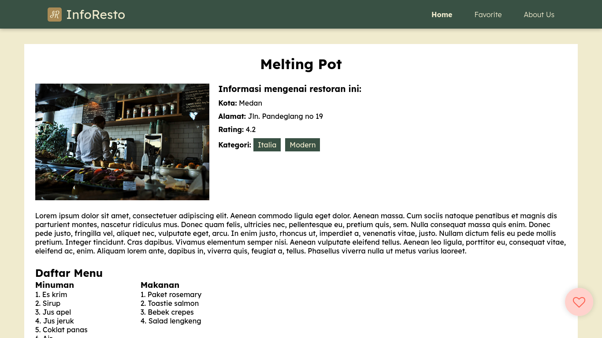
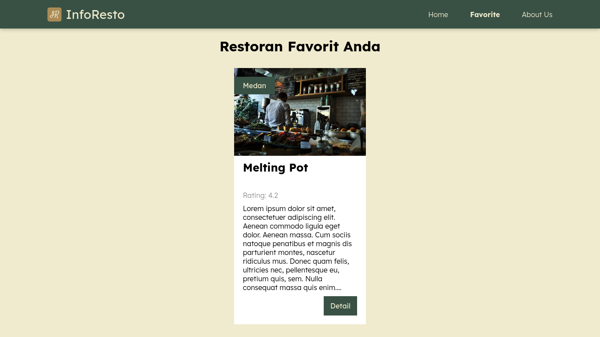

# Simple Notes App

This is submission for Dicoding course "Menjadi Front-End Web Developer Expert"

## Criteria

### Main
- Integration test
- End to end test
- Image optimization
- Bundle optimization
- Fullfilled previous submission criteria

## Overview

### Screenshot

### Links

- [Repository](https://github.com/zaarza/restaurant-catalogue/)
- [Live preview](https://restaurant-catalogue-zaarza.vercel.app/)

## My process

### Features

- Create new note
- Show all note
- Show detail note
- Archive & unarchive note
- Toggle dark mode
- Toggle language (English & Bahasa Indonesia)

### Framework / Library / Tools used

- React
- React Router Dom
- TailwindCSS
- Eslint

### Useful Resources

- Google Fonts
- Font Awesome

## Author

- Website - [Arzaqul Mughny Al Fawwaz](https://www.zaarza.github.io)
- Dicoding Profile - [Arzaqul Mughny Al Fawwaz](https://www.dicoding.com/users/zaarza/academies)